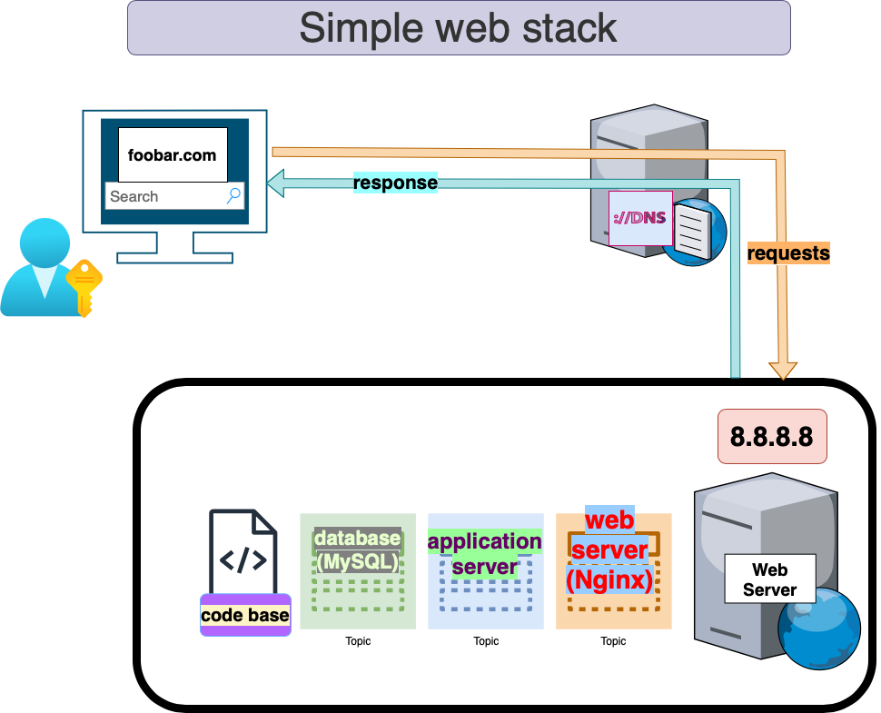

# Single Server Web Infrastructure Design

## Overview

A single-server web infrastructure is designed to host www.foobar.com with components such as Nginx (web server), Gunicorn (application server), MySQL (database), and a domain configured for user access.

## Components

1. **Server:**
   - A server hosts the entire web infrastructure, processing user requests and managing the application components.

2. **Domain Name (foobar.com):**
   - The domain name is a human-readable address pointing to the server's IP (8.8.8.8), enabling users to access the website.

3. **DNS Record for www:**
   - The DNS record for www.foobar.com is a CNAME (Canonical Name) record, directing requests to the main domain.

4. **Web Server (Nginx):**
   - Nginx handles incoming HTTP requests, serving static content, and acting as a reverse proxy for dynamic content.

5. **Application Server (Gunicorn):**
   - The application server executes the codebase, processing dynamic content requests generated by user interactions.

6. **Application Files:**
   - The application files contain the website's codebase, hosted on the application server.

7. **Database (MySQL):**
   - MySQL manages the storage and retrieval of data for the website.

## Infrastructure Specifics

- **Server Communication:**
  - The server communicates with the user's computer using HTTP/HTTPS protocols over the internet.

## Issues with this Infrastructure

1. **Single Point of Failure (SPOF):**
   - The entire infrastructure relies on a single server, posing a risk of downtime if the server fails.

2. **Downtime during Maintenance:**
   - Deploying new code or performing maintenance requires restarting the web server, causing temporary downtime.

3. **Limited Scalability:**
   - The infrastructure may struggle to handle increased traffic, limiting its scalability potential.
