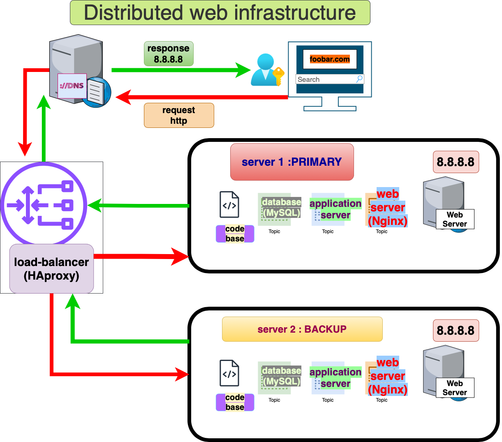

# Three Server Web Infrastructure Design

## Overview

This three-server web infrastructure for www.foobar.com includes Nginx (web server), Gunicorn (application server), HAProxy (load balancer), MySQL (database), and two servers for redundancy and load distribution.

## Components

1. **Server 1 and Server 2:**
   - Two servers are introduced for redundancy, ensuring high availability and fault tolerance.

2. **Web Server (Nginx):**
   - Nginx handles incoming HTTP requests, serves static content, and acts as a reverse proxy for dynamic content.

3. **Application Server (Gunicorn):**
   - The application server executes the codebase, processing dynamic content requests generated by user interactions.

4. **Load Balancer (HAProxy):**
   - HAProxy distributes incoming traffic across multiple servers, providing load balancing for better performance and fault tolerance.

5. **Application Files:**
   - The application files contain the website's codebase, hosted on the application server.

6. **Database (MySQL):**
   - MySQL manages data storage and retrieval for the website.

## Infrastructure Specifics

- **Load Balancer Algorithm:**
  - HAProxy is configured with a Round Robin distribution algorithm. It evenly distributes incoming requests among the available servers.

- **Load Balancer Setup:**
  - The load balancer is configured for an Active-Active setup, meaning both servers actively handle incoming requests to distribute the load.

- **Database Primary-Replica Cluster:**
  - The database is set up as a Primary-Replica (Master-Slave) cluster. The Primary node handles write operations, and the Replica node(s) replicate data from the Primary for read operations.

- **Difference between Primary and Replica:**
  - The Primary node handles write operations and updates the data. The Replica node(s) replicate data from the Primary but only handle read operations, enhancing read scalability.

## Issues with this Infrastructure

1. **Single Points of Failure (SPOF):**
   - The load balancer, web server, and database can be potential single points of failure. Redundancy measures should be considered.

2. **Security Issues:**
   - Lack of firewall protection and absence of HTTPS pose security risks. Implementing firewalls and enabling HTTPS is crucial for securing data transmission.

3. **No Monitoring:**
   - Without monitoring, identifying performance issues, bottlenecks, or potential security threats becomes challenging. Implementing monitoring tools is essential for proactive management.
