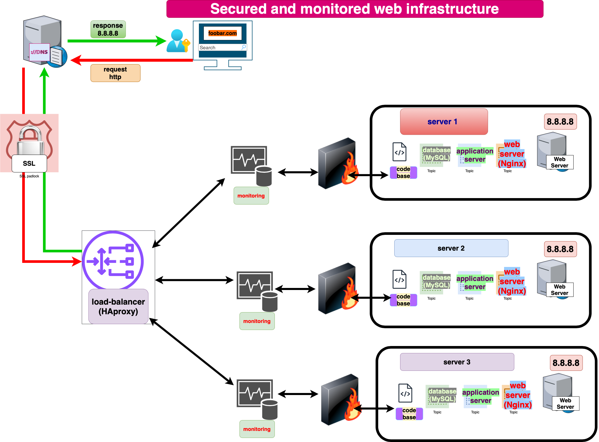

# Secured Three Server Web Infrastructure Design

## Overview

This three-server web infrastructure for www.foobar.com focuses on security, encrypted traffic (HTTPS), and monitoring with added firewalls and SSL certificates.

## Components

1. **Firewall 1, Firewall 2, and Firewall 3:**
   - Firewalls are added for network security, controlling incoming and outgoing traffic to and from the servers.

2. **SSL Certificate:**
   - An SSL certificate is implemented to enable HTTPS, encrypting the traffic between users and the web server for enhanced security.

3. **Monitoring Clients (Sumo Logic):**
   - Monitoring clients (Sumo Logic) are added to collect and analyze log data, providing insights into server performance, security, and potential issues.

## Infrastructure Specifics

- **Firewalls:**
  - Firewalls are added to control and secure network traffic, restricting unauthorized access and enhancing overall system security.

- **HTTPS Traffic:**
  - Traffic is served over HTTPS to encrypt data in transit, preventing eavesdropping and ensuring the confidentiality and integrity of user information.

- **Monitoring Purpose:**
  - Monitoring is used to track server performance, detect anomalies, identify potential security threats, and gain insights into the overall health of the infrastructure.

- **Monitoring Data Collection:**
  - The monitoring tool (Sumo Logic) collects data by ingesting and analyzing log files generated by various components in the infrastructure.

- **Monitoring Web Server QPS:**
  - To monitor web server QPS (Queries Per Second), you can set up specific log metrics or utilize performance monitoring tools to track and analyze request rates.

## Issues with this Infrastructure

1. **Terminating SSL at Load Balancer:**
   - Terminating SSL at the load balancer can expose decrypted traffic within the internal network. End-to-end encryption is preferable for higher security.

2. **Single MySQL Server for Writes:**
   - Having only one MySQL server capable of accepting writes creates a single point of failure. Consider implementing a MySQL cluster for better reliability.

3. **Identical Server Components:**
   - Having servers with identical components may lead to uniform vulnerabilities. Diversifying the components, versions, or configurations can mitigate risks associated with common vulnerabilities.
