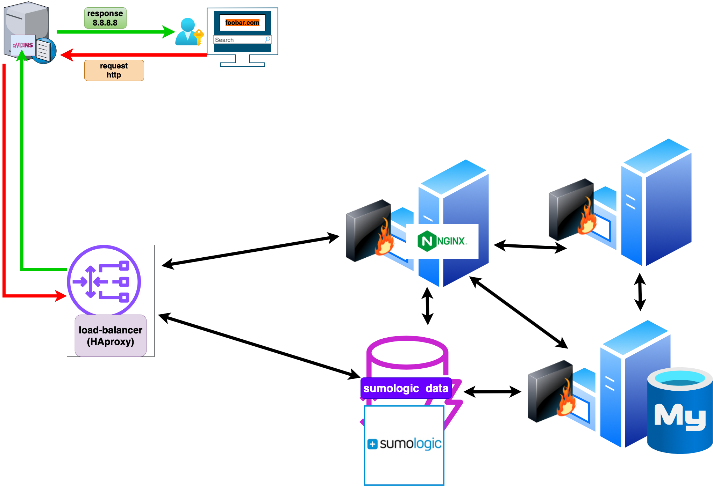

# Large-Scale Web Infrastructure 

## Overview

This high-performance web infrastructure is designed for large-scale hosting of www.foobar.com. It incorporates multiple servers, load balancers, and split components for optimal scalability, reliability, and security.

## Components

1. **Server Cluster:**
   - The server cluster forms the backbone of the infrastructure, handling user requests, load distribution, and component orchestration.

2. **Load Balancers (HAProxy Cluster):**
   - HAProxy is configured in a cluster to provide load balancing at a large scale. Multiple instances distribute incoming traffic across the server cluster, ensuring high availability and efficient resource utilization.

3. **Web Servers (Nginx Cluster):**
   - The web server cluster, powered by Nginx, serves as a robust layer for handling HTTP requests, static content, and acting as a reverse proxy. It is horizontally scalable to manage high volumes of concurrent connections.

4. **Application Servers (Gunicorn Cluster):**
   - Gunicorn forms a scalable application server cluster for executing dynamic content processing. It handles application logic, user requests, and scales horizontally to manage increased demand.

5. **Database Cluster (MySQL Replication):**
   - MySQL is configured in a replication setup with a primary database and multiple replica nodes. The primary node handles write operations, while replica nodes replicate data for read operations, ensuring data availability and scalability.

## Infrastructure Specifics

- **Load Balancer (HAProxy) - Cluster Configuration:**
  - HAProxy is set up as a cluster for redundancy and high availability. It efficiently distributes traffic among multiple web servers, preventing bottlenecks and single points of failure.

- **Web Server and Application Server Scalability:**
  - The web and application server clusters are designed for horizontal scalability. Adding more servers dynamically handles increased traffic and ensures optimal performance.

- **Database Replication:**
  - MySQL replication ensures data consistency and availability. The primary node handles write operations, while replica nodes allow for scaling read operations horizontally.

## Why Additional Elements?

- **High Availability and Redundancy:**
  - The clustered setup for load balancers, web servers, and application servers ensures high availability and redundancy, minimizing the impact of potential failures.

- **Scalability and Elasticity:**
  - The infrastructure is designed to scale horizontally, accommodating growing user traffic and providing elasticity to dynamically adjust resources based on demand.

- **Data Consistency and Read Scaling:**
  - MySQL replication enhances data consistency and allows for scaling read operations. This ensures a responsive and reliable database layer.

This large-scale infrastructure is built for performance, scalability, and reliability. It ensures seamless handling of user requests, efficient resource utilization, and optimal performance at scale.
